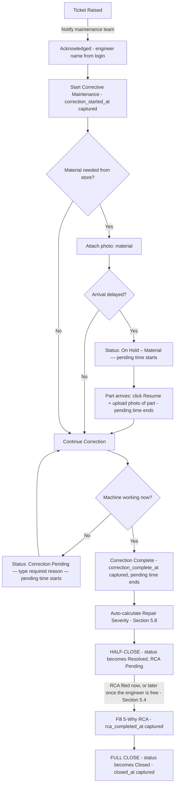

# Greenlam Tracker — Resolved Decisions (Round 2)

**How to use this document:** hand this alongside `Greenlam_Tracker_Build_Specification.md` and `Greenlam_Tracker_Pre-Build_Addendum.md`. Every open item from the addendum is now resolved with a stakeholder decision below, including a new 8th access area (Manager). Where a decision changes specific wording in the original spec, the replacement text is given — the build assistant should treat this file as authoritative wherever it conflicts with the original spec.

**Update:** a distinct **Manager** access area has now been added as an 8th access area (see below) — separate from Admin, so admin can grant it independently. Every reference below to "who can touch tickets" has been updated to include it.

---

## New: Manager access area (8th access area)

**Decision:** add **Manager** as its own access area, distinct from Admin, Supervisor, and Maintenance. This becomes an 8th grant admin can switch on for any account, same pattern as the existing seven — combinable, no bleed-through, not tied to a hard-coded job title.

**Proposed definition** (flag back if any part of this should look different):

| Access Area | Typical Device | What it unlocks |
|---|---|---|
| **Manager** | Personal phone (iOS or Android) | Get notified about flagged tickets (repeat-failure, no-follow-up-production, High Repair Severity) and reopened tickets, same as Supervisor (Section 3, 5.7, 5.9); reopen a closed ticket (Section 5.4); hand off/reassign a ticket on someone else's behalf, the same way a Supervisor already can (Section 5.4, `handed_off_by`) |

**How it differs from the other roles:**
- **vs. Admin** — Manager does not get account approval, master-list editing, or the company-device-only restriction that now applies to Admin (Manager stays on personal phone, in the ticket section, like Supervisor).
- **vs. Supervisor** — same notification and reopen rights; Manager additionally gets to hand off a ticket to a specific engineer on someone else's behalf (workload allocation), which the spec already anticipated as a possibility (the `handed_off_by` field exists for exactly this) but hadn't assigned to a named role yet.
- **vs. Maintenance** — Manager doesn't do hands-on repair work (no Acknowledge/Correction Complete/RCA) — it's an oversight and allocation role, not a hands-on one. A person can of course hold both Manager and Maintenance access if their job needs it, same as any other combination.

**Spec text to replace (Section 3, table, after the Supervisor row, line 26):**
> | Manager | Personal phone (iOS or Android) | Get notified about flagged tickets (repeat-failure, no-follow-up-production, unusually slow to resolve) and reopened tickets; reopen a closed ticket if the problem isn't actually fixed; hand off/reassign a ticket to a specific Maintenance-access person on someone else's behalf (see Section 5.4, 5.7, 5.9) |

**Spec text to replace ("one, several, or all seven" — Section 3, line 36):**
> ...one, several, or all **eight** — so someone can hold HPL Production-only, Maintenance-only, a single Dashboard sub-scope, or any mix, including all eight if that reflects their job.

**Spec text to replace (Section 5.4, Handoff bullet, line 180 — the parenthetical):**
> ...`handed_off_by` (in case a **Supervisor or Manager** reassigns on someone else's behalf).

---

## Resolved: who can reopen a ticket (was Addendum item A1)

**Decision:** anyone with Maintenance, Supervisor, Manager, or Admin access can reopen a closed ticket — no further role restriction. This **replaces** the original rule limiting reopen to "the operator who raised it or anyone with Maintenance access" (Section 3, line 38; Section 5.4, line 189). Operators no longer have reopen rights under this update, since they don't use the ticket-management side of the app.

**Attribution:** already covered by the existing design — names are auto-filled from the logged-in account (Section 3), never typed. Apply this to Reopen the same way: whoever taps Reopen has their name auto-captured, and it should display plainly wherever the reopen shows up — e.g. *"Reopened by Subash"* — in-app, on the dashboard, and in Excel.

**Spec text to replace (Section 3, line 38):**
> Reopening a closed ticket is open to anyone with Maintenance, Supervisor, Manager, or Admin access — since there's no approval step gating closure, the only real safety net (someone noticing the machine's still broken) stays as widely available as possible among the people who actually manage tickets. Every reopen records who did it, shown as "Reopened by [Name]" wherever the ticket appears.

**Spec text to replace (Section 5.4, line 189, first clause only):**
> Reopening a closed ticket: if it turns out the problem isn't actually fixed, anyone with Maintenance, Supervisor, Manager, or Admin access can reopen it — click Reopen and type a required reason.
*(the rest of that bullet, about half-closed vs. fully closed and landing back in Correction Pending, is unchanged)*

---

## Resolved: Admin device restriction (was Addendum item A2)

**Decision:** yes — Admin access requires a company-owned device, enforced the same technical way as the three Dashboard sub-scopes.

**Spec text to replace (Section 3, "Dashboard device restriction" paragraph, line 57):**
> **Company-device restriction:** since management laptops/desktops are company-issued and staff phones are not, this needs to be enforced technically, not just by policy — **for all three Dashboard sub-scopes and for Admin.**

No other change needed — the Conditional Access / IP allow-listing mechanism already described in that section (lines 58–60) now applies to four access areas instead of three.

---

## Resolved: "AC Room" vs. "AC Section" (was Addendum item A3)

**Decision:** keep **AC Room** everywhere. Remove "AC Section."

**Spec text to replace (Section 6.2 table, line 281):**
> Change the row label from `AC Section` to `AC Room` — no other change to that row's content.

---

## Resolved: timestamp source (was Addendum item B1)

**Decision:** server clock under normal conditions; device clock only when the action happens in a dead zone (no connectivity, queued for later sync).

**Spec text to add (Section 5.5, after the existing timestamp paragraph, line 194):**
> **Timestamp source, precisely:** when the device has connectivity at the moment an action happens, the timestamp is assigned by the **server**, on receipt, as today. When the device has no connectivity (the action is queued by the offline auto-save in Section 12), the timestamp is captured from the **device clock at the moment the action was taken on-device**, and travels with the queued entry so it's preserved once it syncs — the server does not re-stamp it with the (later) sync time. This keeps response-time KPIs accurate for genuine dead-zone use, while still keeping the server as the default source of truth whenever a connection is available (which is the normal case this is designed to prevent backdating in).

This also means device-clock-sourced timestamps (queued/offline entries) are worth flagging distinctly in the audit trail internally (not shown in daily use, same treatment as the edit history in Section 7) — so if a device with a badly wrong clock is ever suspected, it's traceable which specific timestamps came from a device clock rather than the server.

---

## Resolved: acknowledgment race condition + handoff scope (was Addendum item B2)

**Decision, part 1 — first tap wins:** whoever taps Acknowledge first on an open ticket gets it. This needs to be enforced atomically at the database level (e.g., a unique/first-write constraint on ticket ownership), not just checked in the UI — otherwise two people tapping within the same second could both succeed. Whoever loses the race sees a message reflecting the current state (e.g., *"Already acknowledged by [Name]"*) rather than a silent failure or a duplicate claim.

**Decision, part 2 — Handoff works from any active status:** Handoff (Section 5.4) should be available whenever a ticket has a current owner — that covers Acknowledged, In Progress, On Hold – Material, and Correction Pending — not restricted to any one step. Reasons can include time management/shift changeover, being overloaded, or the ticket falling outside the current owner's trade. The existing Handoff mechanism (Section 5.4, line 180) already doesn't restrict by status in its current wording, so this is confirming that intent explicitly rather than changing it.

**Spec text to add (Section 5.4, after the existing Handoff bullet, line 180):**
> **Handoff works from any active status** — Acknowledged, In Progress, On Hold – Material, or Correction Pending — not just at one specific step. Common reasons include shift changeover, workload, or the issue falling outside the current owner's Field/Trade; no reason needs to be selected or typed, consistent with keeping Handoff deliberately simple.

*(Optional, not decided yet: if you'd also like a short reason captured with each Handoff for audit purposes, that's a small addition — let me know and I'll write it in. Left out for now to preserve the "no approval, no friction" design intent already stated for Handoff.)*

---

## Resolved: reopen notification (was Addendum item B5)

**Decision:** yes — notify the maintenance team when a ticket is reopened, and the notification text should explicitly say "reopened." Since Supervisor and Manager access already exist to give oversight of tickets, they should get this notification too, same as they do for flagged tickets.

**Spec text to add (Section 9, as a new bullet after line 334):**
> - Instant push notification to the maintenance team, Supervisors, and Managers when a ticket is **reopened** — worded distinctly from the "ticket raised" notification, e.g. *"Ticket #[ID] on [Machine] has been reopened by [Name]"* — so it's never mistaken for a brand-new breakdown.

---

## Resolved: idempotency & offline-queue coverage (was Addendum item B6)

**Decision:** add Handoff, Reopen, and Correct to both the idempotent-submission-ID list and the offline auto-save list.

**Spec text to replace (Section 12, idempotent submissions bullet, line 385):**
> **Idempotent submissions:** every Raise Ticket, Save Draft, Mark as Done/Submit, Acknowledge, Hold, Resume, Correction Complete, RCA field save, **Handoff, Reopen, and Correct** action carries a client-generated unique submission ID. [rest of bullet unchanged]

**Spec text to replace (Section 12, offline auto-save bullet, line 392, first clause):**
> **Offline auto-save & background sync:** every entry a person makes anywhere in the app — raising a ticket, any status action on a ticket (Acknowledge, Hold, Resume, Correction Complete, RCA fields, **Handoff, Reopen, Correct**), production entries and drafts (Section 6.3), and photo uploads (Section 5.10) — auto-saves to the device the instant it's entered... [rest of bullet unchanged]

---

## Resolved: Solve Time formula (was Addendum item C1)

**Decision:** measure Solve Time (and therefore Repair Severity) from `correction_started_at`, not `acknowledged_at`. Continue capturing every timestamp as already specified — nothing is removed, this only changes which two timestamps feed the Solve Time formula.

**Spec text to replace (Section 5.8, line 228):**
> **Solve time = (time from Correction Started to Correction Complete) − total pending time.** Every hold/pending window (waiting for a part, or a "Correction Pending" stall — see Section 5.2) is excluded from this clock and tracked separately as `pending_time_total` (Section 5.3), so a repair that's genuinely quick isn't penalized for time spent waiting on parts or logistics.

**Kept unchanged, tracked separately:** `Repair Start Delay = correction_started_at − acknowledged_at` (Section 5.9) remains its own KPI, showing how long a ticket sat acknowledged before work actually began — it's just no longer folded into Solve Time / Repair Severity.

*(Heads up, not a blocker: since Solve Time now excludes the pre-start wait, machines may show shorter measured repair times than before across the board. The Repair Severity thresholds in Section 5.8 are already admin-configurable — worth a look after a few weeks of real data to see if they need retuning against the new formula.)*

---

## Resolved: tracking Reopened separately from Repeat Failure on the dashboard (was Addendum item C2)

**Decision and the reasoning behind it, confirmed:**
- If the same problem recurs **within 48 hours** of the ticket's `correction_complete_at`, the expected action is to **Reopen the existing ticket** — tracked on the dashboard as a **"Reopened"** count.
- If the same (or a new) problem occurs on that machine **after the 48-hour window has passed**, a **new ticket** gets raised instead — this is a separate, standard ticket and isn't linked to the old one.
- The existing **Repeat-failure flag** (Section 5.7, item 2) still serves its original purpose: catching cases where someone raises a **new** ticket on the same machine within 48 hours **instead of** reopening the old one (e.g., a different shift didn't realize a ticket already existed for it) — this remains a distinct, useful safety net and is not replaced by Reopen.

**Spec text to add (Section 10, Maintenance dashboard bullet, line 344, appended):**
> ...plus the two closure-integrity flags from Section 5.7 (no follow-up production after closure, and repeat failures on the same machine). **"Reopened" tickets and "Repeat-Failure-linked" tickets are tracked and displayed as two separate counts/metrics** — they represent different situations (the same ticket reopened vs. a new ticket raised for a recurring issue) and shouldn't be merged into one "recurring issues" number.

**Spec text to add (Section 5.4, as a new one-line SOP rule, alongside the existing "Reopen vs. Correct" rule at line 181):**
> **Reopen vs. new ticket — the one-line rule for the pilot SOP:** if the same problem comes back within 48 hours of the last fix, **Reopen** the existing ticket. If it's been longer than 48 hours, raise a **new** ticket instead — the system will still flag it as a likely repeat via the Repeat-Failure check (Section 5.7) if it's within its own 48-hour window from the new angle, but it stays a separate ticket.

---

## Confirmed: Correct vs. Reopen distinction (was Addendum item C4 — now confirmed, not just a judgment call)

This matches the "Reopen vs. Correct" rule already written into the spec at Section 5.4, line 181, so no wording change is needed — just recorded here as explicitly confirmed:
- **Correct** (Section 7) = the machine is fine; something was **mistyped** into a field (RCA text, description, etc.). No reason is required because the correction itself is self-explanatory.
- **Reopen** (Section 5.4) = the machine is **genuinely broken again**, within the 48-hour bracket described above. A typed reason is required because it's asserting the prior fix didn't hold.

---

## Resolved: background job for the no-follow-up-production flag (was Addendum item B4)

**Decision:** adopted as described. This flag (Section 5.7, item 1) can only be evaluated once its configured window has actually elapsed — it's checking for the *absence* of production activity, which can't be known until the window closes. Addition to the tech stack (Section 11):

**Spec text to add (Section 11, as a new bullet):**
> **Scheduled job / background worker:** a lightweight recurring job (every 15–30 minutes is sufficient) that checks for tickets whose no-follow-up-production window (Section 5.7) has just elapsed, verifies whether production activity was logged on that machine during the window, and raises the flag + fires the Supervisor notification (Section 9) at that point. Any standard scheduler fits (e.g., a managed cron trigger, or a queue-based worker like BullMQ/Hangfire depending on the chosen backend) — this doesn't need to be complex, it just needs to exist, since nothing currently in the stack performs this check.

---

## Resolved: Excel sync resilience against Graph API throttling (was Addendum item B3)

**Decision:** adopted as described — database write first, Excel sync happens afterward through a queue, never blocking the user-facing save. Addition to Section 8:

**Spec text to add (Section 8, as a new bullet):**
> **Sync resilience:** ticket/production writes to the database must never wait on the Excel sync to complete. Each change is written to the database first, then queued for Excel sync via a background worker, which applies retry-with-backoff on Microsoft Graph API throttling (HTTP 429) or transient failures. A periodic reconciliation check (e.g., daily) compares database records against their Excel rows to catch and repair any sync that failed silently, so drift between the database and the Excel mirror never goes unnoticed.

---

## Resolved: flowchart fixed — two separate boxes (was Addendum item A4)

**Decision:** the flowchart's single blurred node ("Correction Pending / On Hold + reason box") is replaced with two separate boxes, matching the two distinct, already-named statuses — one requiring a photo (parts delay), the other requiring a typed reason (still broken after an attempt). This is the corrected diagram, replacing the one in Section 5.2 in full:

**Spec text to replace (Section 5.2, the mermaid diagram):**

What changed from the original: node H is now explicitly labeled **"Status: On Hold – Material"** (parts-delay path, ends with a photo) and node L is now explicitly labeled **"Status: Correction Pending"** (still-broken-after-attempt path, ends with a typed reason) — no box combines the two names anymore. Also added: `correction_started_at` is now shown captured at node D, since Solve Time (below) now measures from that point rather than from Acknowledged.

---

## Clarification for reference: the Field/Trade badge gap (Addendum item C3)

Field/Trade is only collected at signup if someone selects Department = Maintenance — but Maintenance *access* can be granted independently of that Department field (Section 3, by design). So someone could receive Maintenance access without ever having a Field/Trade on file, and would appear in the Handoff list (Section 5.4) with a blank trade badge, making it unclear whether they're the right person for a given fault type.

**Spec text to add (Section 3, at the end of the Field/Trade description, line 42):**
> If admin grants Maintenance access to someone who doesn't already have a Field/Trade on file, the admin approval screen should require selecting one at that point, so nobody appears in the Handoff list (Section 5.4) without a trade badge.
