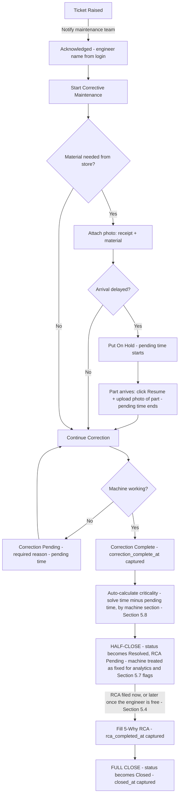

# Greenlam Tracker — Full Build Specification

**Purpose of this document:** This is a build-ready prompt you can hand to a developer, a dev agency, or an AI coding assistant (e.g. Claude Code) to build/rebuild the Greenlam Tracker as a proper multi-user system. Paste the whole thing in as the project brief.

---

> **Revision note — V3 / Trial-readiness update:** This specification incorporates the latest resolved decisions from Round 2 and the latest shop-floor clarification on Resin, Impregnator/Dryer, SAP load plans, and Load No.-based traceability. Where shop-floor practice is not yet confirmed, the design deliberately uses configurable/optional fields rather than inventing a workflow.

## 1. Project Summary

Build a web-based application called **Greenlam Tracker** with two operational modules — **Maintenance Ticketing** and **HPL Production Data Entry** — plus a **role- and device-restricted analytics dashboard**. HPL Production is designed around actual shop-floor working practices: trace production through a manually entered **Load No.** rather than requiring entry of every SAP material code, while keeping detailed material/batch fields only where operators actually know and use them. Shop-floor staff use their own personal phones (iOS and Android, no company-issued devices); management uses company-owned desktops/laptops, and the dashboard must only be reachable from those. It must support hundreds to thousands of concurrent users. Every submission automatically flows into a live Excel export, and the maintenance team gets a phone notification the moment a ticket is raised.

## 2. Why the current version needs a rebuild, not a patch

If the existing app only runs on one laptop, it's almost certainly storing data locally (browser storage, a local file, or a local server bound to `localhost`) rather than on a shared, always-on backend. That approach cannot support many simultaneous users. The rebuild needs:

- **A centralized backend + real database** (PostgreSQL/MySQL/SQL Server) as the single source of truth — not a shared Excel file being written to directly by many users at once (this causes file-lock errors and data loss under concurrent access).
- **A hosted web app** on a centrally managed server (see Section 14 on hosting) so any device just opens a URL — no per-device software installation required.
- **A Progressive Web App (PWA)** front-end so people can "install" it to their phone/desktop home screen like an app, while it's really just the website — this satisfies "downloaded and used by hundreds of people" without needing App Store/Play Store approval, which matters since staff are using personal phones.
- Excel becomes an **automatically generated export/mirror** of the database, not the database itself.

## 3. User Roles & Devices

| Access Area | Typical Device | What it unlocks |
|---|---|---|
| HPL Production | Personal phone (iOS or Android) | Raise tickets, submit production data, see the daily HPL Production log |
| Maintenance | Personal phone (iOS or Android) | Receive ticket notifications, acknowledge/work/close tickets, see the ticket summary counts |
| Supervisor | Personal phone (iOS or Android) | Get notified about flagged tickets (repeat-failure, no-follow-up-production, unusually slow to resolve) and reopen a closed ticket if the problem isn't actually fixed (see Section 5.4, 5.7) |
| Manager | Personal phone (iOS or Android) | Get notified about flagged/reopened tickets; reopen tickets; hand off/reassign tickets to a specific Maintenance-access person on someone else's behalf |
| Dashboard | Company-owned desktop/laptop **only** | View the analytics dashboards |
| Admin | Company-owned desktop/laptop | Approve new accounts, grant/change access areas, manage the Machine Master List and dropdown options |

**Dashboard permission model:** **Dashboard** is one access grant, not three separate grants. The three dashboard views (Maintenance, HPL Production, Combined) are views within that single Dashboard access area; there are no separate Dashboard sub-scope permissions.

**These are independent, combinable grants, not a single fixed role.** Admin switches on whichever areas apply to each person — one, several, or all six — so someone can hold HPL Production-only, Maintenance-only, Supervisor-only, Manager-only, Dashboard-only, Admin-only, or any mix, including all six if that reflects their job. There's no cap on how many areas one person can hold. (In everyday language, operators will typically be granted HPL Production access and technicians Maintenance access — but that's a default expectation, not a hard rule; admin can assign however the job actually requires.)

**Reopening a ticket is an operational action:** anyone with **Maintenance, Supervisor, Manager, or Admin** access can reopen a half-closed or fully closed ticket if the problem is not actually fixed (see Section 5.4). The operator who originally raised the ticket does not receive a separate Reopen permission unless they also have one of those access areas.

**Account creation & approval — how access is granted:**
- Anyone can create their own account in the app — choose a username, set a password/PIN, enter their name — but a brand-new account starts with **no access to anything** until an admin approves it.
- Admin sees a queue of pending sign-ups and, for each one, switches on whichever access area(s) apply (HPL Production / Maintenance / Supervisor / Manager / Dashboard / Admin), in any combination.
- Once approved, the person's home screen shows only the section(s) they've been granted — if they hold more than one, they see more than one tile/section to choose from.
- Admin can revisit anyone's access at any time — add, remove, or fully revoke.
- **Bootstrapping note:** the very first Admin account can't be self-approved (there's no admin yet to approve it), so it needs to be provisioned directly during setup/deployment. Every account after that follows the self-signup + approval flow above.
- Once logged in, the app already knows the person's granted access area(s) and name — this determines what screens they see and who receives ticket notifications.
- **Name fields are auto-filled from the logged-in account, not freely typed**, wherever a name is captured (raising a ticket, acknowledging one, submitting production data). This removes typos and prevents a fix being logged under the wrong person's name. (This replaces the free-text name fields described in Sections 5 and 6 below.)

**Since staff are on personal (BYOD) phones, not company-managed ones:**
- The app must be usable on both iOS and Android from a regular mobile browser — no MDM enrollment, no company profile required.
- Request only the permissions actually needed (notifications, and camera access only when uploading a receipt/material/pack-order photo) — nothing that reads into the rest of a personal phone.
- **iOS-specific requirement:** iOS only delivers web push notifications to a PWA that has been added to the Home Screen (Safari tabs alone won't receive pushes on iOS, even on recent versions). Build a short one-time onboarding step ("Add to Home Screen") into first use for iPhone users, or the maintenance team simply won't get ticket alerts.
- Personal phones will connect over their own **mobile data**, not just factory Wi-Fi — so the app needs to be reachable over the public internet, not confined to the internal company network. This has real implications for hosting and security (see Section 14).

**Company-device restriction:** since management laptops/desktops are company-issued and staff phones are not, this needs to be enforced technically, not just by policy — for Dashboard and Admin. Recommended approach, given the company already uses Microsoft 365:
- Use **Microsoft Entra ID (Azure AD) Conditional Access** to require Dashboard/Admin sign-in to come from a company-managed/compliant device (this requires Entra ID P1 licensing — confirm with IT whether that's included in your Microsoft 365 plan).
- If Conditional Access isn't available, fall back to **IP allow-listing on the dashboard route specifically** — e.g. requiring company devices to connect through a VPN or a fixed office IP range to reach the dashboard, even though the rest of the app (ticketing/production) stays open on the internet for staff on mobile data.
- Either way, this sits **on top of** the normal login and access-area approval — a company device alone shouldn't be enough, the person also needs Dashboard access granted to their account.

---

## 4. Machine Master List

This is the source list for the "Machine Name" dropdown used in both the Maintenance Ticketing and HPL Production modules. Numbering follows your phase layout so any technician instantly knows which physical unit is meant.

| Category | Units |
|---|---|
| Resin Kettle | 7 units — numbered 1 to 7 |
| Impregnator / Dryer | 12 units — numbered 1 to 12 |
| AC Room | AC Room – Phase 1 · AC Room – Phase 2 |
| Press | Press 1, Press 2, Press 3 (Phase 1) · Press 4, Press 5 (Phase 2) |
| Cutting – Shearing Machine | Shearing Machine – Phase 1 · Shearing Machine – Phase 2 |
| Cutting – D.D. Saw Machine | D.D. Saw 1, D.D. Saw 2, D.D. Saw 3 (Phase 1) · D.D. Saw 4, D.D. Saw 5 (Phase 2) |
| Sanding | Sanding 1, Sanding 2 (Phase 1) · Sanding 3, Sanding 4 (Phase 2) |
| **Other** | Free-text field — lets the user manually type in any equipment not covered above |

This list should live in an **admin-editable table**, not hard-coded, so machines can be added/renamed later without a developer.

---

## 5. Module 1 — Maintenance Ticketing

### 5.1 Raising a ticket
Operator fills in:
- Machine name (dropdown, from the Machine Master List)
- What happened (free text description)
- Operator name (auto-filled from the logged-in account — see Section 3)
- Shift (see Section 5.5 — operators only, 12-hour shifts)
- Date & time — **auto-captured by the system clock at the moment of submission, not typed in by the operator** (see Section 5.5 for why this matters)

On submit → ticket created with status **Open**, timestamp logged. **Push notification sent instantly to the maintenance team's phones** (see the iOS Home Screen note in Section 3).

### 5.2 Full ticket lifecycle (state machine)

**Authoritative ticket status list:** The exact operational status values are **Open**, **Acknowledged**, **In Progress**, **On Hold – Material**, **Correction Pending**, **Resolved, RCA Pending**, and **Closed**. **Reopened** is an action/event that returns a ticket to **Correction Pending**; it is not a separate long-lived status. **Correct** is a data-correction action and does not change the ticket status.

**Why the close happens in two stages:** if RCA had to be filed before the ticket could close at all, an engineer juggling several breakdowns at once would be stuck writing paperwork on ticket #1 instead of fixing machine #2. Splitting the close lets the machine get marked fixed — and counted as fixed everywhere that matters (Section 5.3, 5.6, 5.7) — the moment Correction Complete is hit, while the RCA itself can wait until there's a free moment, even if that's a different shift entirely.

### 5.3 Required timestamps (every stage is time-stamped)

| Stage | Field to log |
|---|---|
| Ticket raised | `raised_at` |
| Acknowledged (+ maintenance engineer's name, auto-filled from login) | `acknowledged_at` |
| Corrective maintenance started | `correction_started_at` |
| Material requested (if applicable) | `material_requested_at` |
| Put on hold (waiting for material) | `hold_started_at` |
| Resume correction (part confirmed via photo) | `hold_ended_at` |
| Correction marked pending (with required reason) | `pending_at` (repeatable) |
| **Correction complete — ticket half-closes to "Resolved, RCA Pending"** | `correction_complete_at` |
| Criticality auto-calculated (see Section 5.8) — fires immediately after Correction Complete, does not wait on the RCA | `criticality_calculated_at` |
| **5-Why RCA filed** | `rca_completed_at` |
| **Ticket fully closes** (only once the RCA is filed) | `closed_at` |
| Ticket reopened after being closed, if it happens (see Section 5.4) | `reopened_at` (repeatable) |

**Pending time:** every hold/pending window above (`hold_started_at`→`hold_ended_at`, and each `pending_at` occurrence) is summed into a `pending_time_total` for the ticket. This is tracked as its own field, separate from the timestamps that measure actual repair time — see Section 5.8 for how it's used.

**Half-close vs. full close — and which one analytics uses:** `correction_complete_at` is the moment the machine is actually back up — the ticket immediately half-closes to a **"Resolved, RCA Pending"** status, which takes it out of the active-breakdown count (Section 5.6) even though the 5-Why RCA hasn't been written yet. `closed_at` only fires once the RCA is filed and the ticket fully closes — this can happen seconds later, or hours/days later if the engineer got pulled onto another breakdown first (see Section 5.4). **`correction_complete_at` and `closed_at`/`rca_completed_at` are tracked as two separate fields on purpose.** **Time to Resolve** and the closure-verification flags in Section 5.7 use `correction_complete_at` and never `rca_completed_at` or `closed_at`. **Criticality** is calculated separately using the Solve Time formula in Section 5.8, which starts at `correction_started_at`. That way, a backlog of un-filed RCAs during a busy stretch never makes a repair look slower than it actually was.

These timestamps let the dashboard calculate Time to Acknowledge, Time to Resolve, and time lost waiting on materials, per machine and per technician. **Every timestamp in this table is captured automatically by the system at the moment the action occurs — none of them are fields a person types in** (see Section 5.5 for why).

### 5.4 Rules
- Only the maintenance person who acknowledged the ticket (or someone they hand off to) can progress it further.
- Criticality is no longer chosen by a person — it's calculated automatically once the repair is done, based on how long it actually took (see Section 5.8).
- The material-needed branch requires a photo of the receipt and the material before proceeding.
- **Resuming after a parts hold requires proof:** when the part arrives, the engineer must click **Resume** and upload a photo of the arrived part before the ticket can continue — this is what captures `hold_ended_at` and ends that pending window. Simply waiting isn't enough to move the ticket forward.
- "Correction Pending" always requires a typed reason.
- **Two-stage close:** marking **Correction Complete** immediately half-closes the ticket to a **"Resolved, RCA Pending"** status — the machine counts as fixed from that instant on (Section 5.3, 5.6, 5.7) — but the ticket itself isn't fully **Closed** yet. 5-Why RCA (5 sequential text fields) is mandatory before the ticket can **fully** close, but it is **not** required to reach the half-close. This is deliberate: when several breakdowns land at once, an engineer can fix a machine, mark Correction Complete, and go straight to the next ticket, then come back and file the RCA on the first one whenever they get a free moment — hours or shifts later if needed.
- **Handoff works from any active status** — Acknowledged, In Progress, On Hold – Material, or Correction Pending — and may be used for shift changeover, workload balancing, or trade mismatch. The receiving engineer must have Maintenance access; previous owner, new owner, handoff time, and who performed the handoff are recorded.
- **Reopen vs. new ticket — pilot SOP:** if the same problem comes back within 48 hours of the last fix, Reopen the existing ticket. If it has been longer than 48 hours, raise a new ticket. The system keeps Reopened and Repeat-Failure as separate metrics.

- **Filing the RCA is what triggers the full close.** Once the 5-Why RCA is saved on a half-closed ticket, it fully closes automatically (`closed_at` captured) — no separate "Close" click is needed at that point.
- **Every ticket is self-closed directly by the maintenance person who solved it, at both stages** — they mark Correction Complete themselves (half-close) and later file the RCA themselves (full close) — regardless of what criticality it ends up calculated as. There is no approval step at either stage.
- **Reopening a ticket:** if it turns out the problem isn't actually fixed, anyone with **Maintenance, Supervisor, Manager, or Admin** access can reopen it — click **Reopen** and type a required reason. The person who reopened it is recorded and shown as "Reopened by [Name]". This works for both half-closed and fully closed tickets and returns the ticket to Correction Pending. This works the same way whether the ticket is **half-closed** ("Resolved, RCA Pending") or **fully closed** ("Closed") — either state sends the ticket back to Correction Pending (captured as a new `reopened_at`), and it works through the same steps again, including a fresh `correction_complete_at` and eventually a fresh `closed_at`, once it's genuinely fixed. This is a real operational reopen, not the clerical **Correct** action described in Section 7 — the two are kept deliberately separate (see Section 7 for why).
- **Editing while not yet fully closed:** the ticket owner (or their handoff recipient) can go back and revise any previously entered *content* field — the initial description, hold/pending reason, RCA text, etc. — as many times as needed any time before the ticket **fully** closes, **including while it's sitting half-closed in "Resolved, RCA Pending."** This is normal in-progress work, not the Section 7 correction workflow, so it is **not** tagged "Edited." System-captured timestamps are the one exception: they're never directly user-editable, at any stage — a wrong timestamp can only be fixed via the always-tagged correction path in Section 7 (see Section 5.5).

### 5.5 Shift structure
- **Operators** work **12-hour shifts** (two shifts covering 24 hours), but the exact clock start/end can shift day to day — so don't hardcode a fixed schedule like 6:00–18:00. Instead, the operator manually **selects which shift** (Shift 1 / Shift 2) they're on wherever the field appears (ticket raising, production entry) — this is a simple label choice, not a timestamp.
- **The actual timestamps (when a ticket was raised, acknowledged, closed, etc.) are never manually typed in — they're auto-captured by the system clock the instant each action happens.** This is deliberate: if people could type their own times, someone could quietly backdate a "raised at" or "closed at" to make their response look faster than it was, and the whole point of tracking downtime/resolution time would be undermined. If a captured timestamp is ever genuinely wrong, it's fixed through the correction workflow in Section 7 — tagged "Edited," inside the time window or with admin approval — never by silently retyping it.
- **Timestamp source:** when connected, timestamps are assigned by the server on receipt. If an action occurs in a dead zone and is queued offline, capture the device timestamp at the moment the action happened and preserve it through sync; mark such timestamps internally as device-clock sourced for auditability.
- **Maintenance engineers have no fixed shift.** Anywhere an engineer's name is captured (acknowledgment, ownership of a ticket), do **not** show a shift field — just their name.

### 5.6 In-app ticket summary
Inside the Maintenance section itself (not the restricted dashboard), show a simple live status strip so anyone with maintenance access can see where things stand at a glance:
- **Raised** — number of tickets created (default view: today, with the option to switch to all-time or a custom date range)
- **Pending** — number of tickets where the machine itself is still down (Open + Acknowledged + In Progress + On Hold – Material + Correction Pending), regardless of when they were raised — this should reflect current backlog, not just today's. **Half-closed tickets ("Resolved, RCA Pending") do not count here** — the machine is already fixed at that point, even though the RCA is outstanding.
- **RCA Pending** — number of half-closed tickets waiting on their 5-Why RCA, so the maintenance team can see their RCA backlog at a glance and clear it once things quiet down
- **Completed** — number of tickets **fully closed** (RCA filed, `closed_at` captured) (default: today, with the same date-range option)

This is a lightweight in-app counter, separate from the full analytics in the company-device-only dashboard (Section 11) — it's meant to be glanceable on a phone, not a reporting tool.

### 5.7 Closure verification controls
Closing a ticket too early — before the machine is actually verified running — quietly corrupts the downtime data the whole system exists to produce. Every ticket is self-closed directly by the person who solved it, with no approval step in the way (Section 5.4), so both checks below work **after the fact** — they surface a flag for whoever reviews the dashboard rather than blocking anyone from closing.

**Both checks key off `correction_complete_at` (the half-close point, Section 5.3), not `closed_at`.** The machine is actually back in service the moment Correction Complete is marked — full closure can lag behind by hours or days if the RCA is filed later (Section 5.4), and neither flag should wait on that paperwork to fire:

1. **No-follow-up-production flag.** Since the HPL Production module already logs entries per machine, the system checks whether that machine shows any production activity within an expected window **after `correction_complete_at`**. No activity in that window surfaces a **soft, informational flag** on the Maintenance/Combined dashboard — worth a look, but not treated as proof of anything on its own. Production depends on the planning schedule, not just machine health — if the next planning cycle simply doesn't call for that machine to run, there'll be no production entries even though the repair was genuine, so this flag is deliberately advisory rather than an automatic red alert. (Exact window is admin-configurable — see Section 16.)
2. **Repeat-failure flag.** If a new ticket is raised on the **same machine** within **48 hours** (default, admin-configurable — see Section 16) **after a previous ticket on it reached `correction_complete_at`**, the system automatically links the two and flags them on the dashboard for review — purely based on ticket timing. This check is deliberately kept **independent of control 1** — it doesn't require or check for missing production data in between, since that would inherit the same planning-related false-alarm risk. A quick repeat breakdown, on its own, is one of the clearest signs a prior fix was premature or didn't hold.

Neither of these is a blocker — they don't stop anyone from closing a ticket, they surface a red flag afterward for whoever reviews the dashboard. If a closure genuinely needs undoing, that's what **Reopen** is for (Section 5.4) — not these flags, and not the Correct action in Section 7.

### 5.8 Automatic criticality calculation
Criticality is no longer picked by a person — it's calculated automatically once the repair is finished, based purely on how long the actual repair work took:

**Solve time = (time from Correction Started to Correction Complete) − total pending time.** Every hold/pending window (waiting for a part, or a "Correction Pending" stall — see Section 5.2) is excluded from this clock and tracked separately as `pending_time_total` (Section 5.3), so a repair that's genuinely quick isn't penalized for time spent waiting on parts or logistics.

This calculation runs the instant the ticket half-closes at Correction Complete (Section 5.2, 5.3) — it does **not** wait for the 5-Why RCA or the ticket's full closure, so a deferred RCA never delays or skews the criticality result.

| Machine section | Low | Medium | High |
|---|---|---|---|
| **Press** | Under 30 min | 30 min – 1 hr | Over 1 hr |
| **All other machines** | Under 1 hr | 1 hr – 2 hr | Over 2 hr |

The result is stored on the ticket and shown wherever criticality appears — dashboard, Excel, filters — but it doesn't gate or delay closing (see Section 5.4: every ticket is self-closed by the person who solved it). A "High" result is purely a label for the Supervisor/dashboard to notice and follow up on, not an approval requirement. Thresholds are admin-configurable per machine section — see Section 16.

---

## 6. Module 2 — HPL Production Data Entry

### 6.1 Common fields (every entry)
- Machine name (dropdown, from the Machine Master List — determines which fields appear below)
- Operator name (auto-filled from the logged-in account)
- Shift (12-hour, manually selected as Shift 1 / Shift 2) & time — time is **auto-captured by the system**, not typed in
- **Load No.:** the primary production traceability key for the **Press and the downstream process**. It is a short manual entry taken from the SAP load plan; the app does **not** connect to SAP and does **not** require operators to enter the 60+ SAP material codes contained in a load. **Do not make Load No. a mandatory field in the Impregnator/Dryer entry**, because kraft paper is impregnated according to availability and ready-to-press stock/press requirement, not against a particular SAP load plan.
- **Sheets rejected** (count) + reason box (optional free text) — reusable component

**Important shop-floor design rule:** do not force a single planning model onto every process. The app records what actually happened. The **Press is load-plan driven**: treated paper is selected/assembled and sent to the Press according to the SAP load plan. The **Impregnator/Dryer is availability driven**: kraft paper is impregnated according to current kraft availability, ready-to-press stock and the requirements of the Press; it is not normally planned one-to-one against a particular SAP Load No. Resin activity follows the actual resin/batch process used on the shop floor.

### 6.2 Machine-specific fields

| Machine section | Fields to capture |
|---|---|
| **Resin** *(Resin Kettle, from the Machine Master List)* | **Batch number is optional/configurable**. Do not introduce a large material/order dropdown unless the actual resin process is confirmed to use one. Capture the resin batch/reference only when it is available in the operator's normal record, plus quantity/remarks if the plant decides these are useful. |
| **Impregnator / Dryer** | **No Load No. requirement for normal entry** · resin batch/reference **when actually available** · kraft paper grade/type · paper GSM · paper thickness before/after treatment (if recorded) · RC/VC (if recorded) · supplier/company (if recorded) · cutting size · machine speed · zone/cooling temperatures · quantity rejected after cutting · rejection reason. The entry represents treated-paper production/stock, not a direct SAP-order allocation. Avoid mandatory fields that operators do not normally record. |
| **AC Room** | Load No. · upload pack-order photo when normally available (one per lot/load) · sheets processed/rejected · rejection reason (optional). |
| **Press** | **Load No. (mandatory)** · number of lots made · sheets accepted · sheets rejected · rejection reason. The Load No. represents the SAP load plan; the 60+ SAP material codes within that load are **not entered individually**. |
| **Cutting** (Shearing Machine or D.D. Saw — pick the specific unit from the Machine Master List) | Load No. (where traceability is required) · number of sheets done · number of sheets rejected · rejection reason. |
| **Sanding** | Load No. (where traceability is required) · number of sheets sanded · number of sheets rejected · rejection reason. |

The form should show/hide the relevant block based on which machine the operator selects — do not show all blocks at once. Fields that are not part of the normal operator record should be optional or omitted rather than turned into mandatory dropdowns.

### 6.2A Load-level traceability model

The production system must treat **Load No. as the main traceability bridge** between the SAP planning world and the Tracker. SAP remains external and read-only to this project. Operators manually enter the Load No. from the SAP load plan.

A single SAP load plan may contain 60+ material codes representing multiple characteristics (plant, texture, size, domestic/export, GSM, paper grade, design number, etc.) that are subsequently assembled into the press cycle. The Tracker therefore **must not require material-code-by-material-code entry**. Instead:

1. **Load No. is created/identified from the SAP load plan.**
2. Press entry records the Load No. and actual production quantities/rejections.
3. **AC/treated-paper handling records use the Load No.** where the treated paper is being assembled/issued for a particular press load. The Impregnator/Dryer entry itself remains independent of Load No. because kraft paper is impregnated according to availability, ready-to-press stock and Press requirement.
4. Resin entries remain batch/process oriented and are not artificially tied to an order/load when the real process does not work that way.
5. Downstream Cutting/Sanding entries may carry the Load No. so output and rejection can be traced back to the press load.
6. Dashboard and Excel reports can then search/filter by Load No. and show all Tracker records that actually reference it.

**Do not infer planning from Load No.** A Load No. is a press-load traceability reference. It does not mean that the kraft paper or impregnator production was planned specifically for that load. Kraft paper is processed according to availability and stock/Press requirement; treated paper is subsequently used on the Press according to the SAP load plan.

### 6.2B Minimal operator-entry principle

The HPL Production form is not intended to digitize every planning decision. It should capture the minimum reliable facts needed for traceability and KPI analysis. If an operator cannot reasonably know a value at the time of entry, the field should be optional, configurable, or captured in a later process rather than forcing a guess.

### 6.3 Draft & final submission
An entry doesn't have to be filled in and finished in one go. Two states:
- **Draft (in progress):** the operator can save partial progress and come back to it later — add, change, or fix any field freely, as many times as needed. A draft is private to the operator who started it: it does **not** appear in the daily entry log (Section 6.4), the dashboard, or the Excel export yet, and it's never tagged "Edited" no matter how many times it changes.
- **Submitted (final):** once the operator presses **Done**, the entry becomes final — it now appears in the daily log, dashboard, and Excel. From that point on, any change to it goes through the correction workflow in Section 7 (self-edit window, then admin-only) and is tagged **"Edited."**

This mirrors how a ticket is freely editable while open and only tracked once it closes (Section 5.4) — for a production entry, "submitted" is the equivalent of "closed."

### 6.4 Daily entry log
Inside the HPL Production section itself, show a simple list of the day's **submitted** entries — machine, operator, shift, time, and the key batch fields — so operators and engineers can review what's already been logged for the shift without needing dashboard access. Drafts still in progress don't appear here until they're submitted. Default view: today, with the ability to page back to previous days.

---

## 7. Editing & Correction Workflow

If a ticket or production entry was logged by mistake, the person who submitted it (or an admin) can correct it — but the correction has to be visible and traceable everywhere the data shows up, not a silent overwrite.

- **Who can edit, and until when:**
  - **Maintenance tickets:** the person who owns the ticket can self-edit **any section of it** for up to **5 hours after the ticket is fully closed** (i.e., after `closed_at` — RCA filed, not just the Correction Complete half-close; see Section 5.2, 5.3). After that 5-hour window, self-edit is locked — any further correction needs admin to either make the change directly or explicitly unlock the ticket for editing.
  - **HPL Production entries:** the operator who submitted the entry can self-edit **any section of it** for up to **10 hours after submission** (i.e., after they press **Done** — see Section 6.3). After that 10-hour window, the same admin-only rule applies.
  - **Admin can always edit or unlock either type**, regardless of how much time has passed.
  - **This is a correction, not a reopen.** Fixing a fully closed ticket only ever changes the specific field(s) being corrected — the ticket's status stays **Closed** and `closed_at` never moves. It's completely separate from the **Reopen** action (Section 5.4), which is the real operational reopen for when a machine genuinely breaks down again or a fix didn't hold, and which now works from a half-closed ticket too (Section 5.4). Keeping these separate matters: if a correction accidentally flipped a ticket back to an active status, it would wrongly reappear in the live Pending count (Section 5.6) and could falsely trigger the repeat-failure flag (Section 5.7) for something that was never actually broken.
  - While a ticket is **not yet fully closed** — including while it's sitting half-closed in "Resolved, RCA Pending" (Section 5.2, 5.4) — the owner can freely revise any previously entered content field, and can file or revise the RCA itself, without any of it counting as a "correction" or being tagged "Edited" (see the new rule in Section 5.4). The 5-hour rule, the "Edited" tag, and the rest of this section apply only once a ticket has **fully** closed.
  - While an HPL Production entry is still a **Draft** (not yet submitted), the operator can freely revise it the same way — not a "correction," not tagged "Edited" (see Section 6.3). The 10-hour rule and the tag apply only once the entry has been submitted.
- **How it works:** the user opens the entry, chooses **Correct** (a small, labeled action — never the same button as Reopen), changes the relevant field(s), and saves. The record is updated in place — it does not create a second, separate entry.
- **Tagging:** an edited entry is marked **"Edited"** everywhere it's shown:
  - In-app (ticket list, in-app ticket summary counts in Section 5.6, and the daily HPL Production log in Section 6.4)
  - On the dashboard (Section 11) — the "Edited" badge/flag should be visible next to the affected record
  - In the Excel export — add an `Edited` column (Yes/No) plus `last_edited_by` and `last_edited_at` columns
- **Excel behaviour:** an edit must **update the existing row in the Excel workbook, not append a new one** — the sheet should always show only the current, corrected data for that entry, never both the old and new version side by side. To make this possible, every ticket and production entry needs a **stable unique ID** that's written into a (can be hidden) column in the Excel sheet when the row is first created; when an edit happens, the backend looks up that ID via the Microsoft Graph API and overwrites that specific row rather than adding a new line.
- **Audit trail (kept internally, not shown in daily use):** even though the app, dashboard, and Excel only ever display the latest corrected version, the backend should retain the pre-edit value(s) — what changed, who changed it, and when — in an internal edit history. This matters in a factory setting: it means a genuine correction is easy to make, but it's still possible to look back and see what the original entry said if that's ever needed, rather than a correction being able to quietly erase the record of a mistake.

---

## 8. Automatic Excel Sync

Confirmed: the company runs **Microsoft 365** on the company desktops/laptops, so:

- Every ticket and every production entry automatically appends a row to a shared Excel workbook in **SharePoint/OneDrive**, synced via the **Microsoft Graph API** — no manual export step, and it opens normally in Excel for anyone with access.
- Separate tabs: `Tickets`, `HPL Production` (optionally split further by machine section).
- HPL Production rows include a **Load No.** column wherever a load reference was captured, enabling Excel users to filter a complete load history without storing all SAP material codes.
- **Edits update the matching row in place** rather than adding a new one — see Section 7 for how this is tracked.
- The Excel file is a **read-only mirror** for people who want to work in Excel — the database remains the source of truth for the app and dashboards.

## 9. Notifications
- Instant push notification to the maintenance team when a ticket is raised.
- Instant push notification to Supervisors and Managers when a ticket is flagged (repeat-failure, no-follow-up-production, or comes out High-criticality) for awareness — no approval action needed (Section 5.7, 5.8).
- Instant push notification to the maintenance team, Supervisors, and Managers when a ticket is **reopened**, with wording that clearly says it was reopened rather than newly raised.
- Since staff are on personal phones on both iOS and Android: use **Web Push (VAPID)** through the installed PWA on both platforms. Remember the iOS requirement from Section 3 — the PWA must be added to the Home Screen for push to work at all on iPhone.
- Ask for notification permission only, with a clear one-line explanation ("so you're alerted the moment a ticket is raised") — since this is a personal device, don't bundle in unrelated permission requests.
- Optional nice-to-have: notify the operator who raised the ticket when it's acknowledged/closed, so they know someone's on it.

## 10. Authoritative KPI Definitions

The following KPI names and formulas are canonical. Use these exact names in the database, dashboard labels, Excel columns, and developer documentation. Do not create a second field for a synonym.

| KPI | Definition / Formula | Notes |
|---|---|---|
| **Time to Acknowledge** | `acknowledged_at − raised_at` | Measures response time after ticket creation. |
| **Repair Start Delay** | `correction_started_at − acknowledged_at` | Separate KPI; not included in Solve Time. |
| **Pending Time** | Sum of all material-hold and Correction Pending windows | Stored as `pending_time_total`. |
| **Solve Time** | `(correction_complete_at − correction_started_at) − pending_time_total` | Measures active repair work only and feeds Criticality. |
| **Time to Resolve** | `correction_complete_at − raised_at` | Calendar elapsed time from ticket raise until the machine is restored; pending time is not subtracted. This is the canonical dashboard KPI name. |
| **RCA Completion Time** | `rca_completed_at − correction_complete_at` | Measures time between machine restoration and RCA completion. |
| **First-Time Fix Rate** | Tickets resolved without a subsequent Reopen for the same breakdown | Reporting window and matching logic must use `correction_complete_at`. |
| **Repeat Failure Rate** | New tickets on the same machine within the configured repeat-failure window after a prior `correction_complete_at` | Safety-net metric; expected same-problem handling is Reopen. |
| **Reopen Rate** | Reopened tickets ÷ tickets reaching Correction Complete | Reported for the selected date range. |
| **Production Rejection Rate** | Rejected quantity ÷ total processed quantity, where both quantities are captured | Calculated only where the process provides the required quantities. |

**Timestamp rule:** KPI calculations use server timestamps when connected; offline actions use the captured device timestamp and are flagged internally as device-clock sourced.

## 11. Dashboards

- **Access:** login-gated, requires the Dashboard access area to have been granted by admin, **and restricted to company-owned desktops/laptops only** (see Section 3 for how to enforce the device restriction).
- **Three views:**
  1. **Maintenance dashboard** — ticket volumes, Time to Acknowledge, Time to Resolve, criticality breakdown, downtime by machine, time lost waiting on materials, RCA themes, plus the two closure-integrity flags from Section 5.7 (no follow-up production after closure, and repeat failures on the same machine).
  2. **HPL Production dashboard** — output volumes, rejection rates by machine/section, **Load No.-based traceability**, per-shift/operator performance, and process/batch traceability where those fields are actually captured. It must not imply that every SAP material code is available in Tracker.
  3. **Combined dashboard** — correlates machine downtime (maintenance) against production output/rejection trends, so the impact of breakdowns on output is visible in one place.
- All three dashboard views auto-update from the live database — no manual refresh or re-import.
- Records that have been corrected show the **"Edited"** tag from Section 7, so anyone reviewing the dashboard can see a number has been amended since it was first logged.
- **Ad-hoc analysis feature:** let a dashboard user upload an arbitrary Excel file and get it charted/analyzed on the spot, independent of the main database (useful for one-off comparisons).

### 11.1 Filterable reporting (covers day/time/machine/machine-type/module views)
Rather than building a separate fixed report for every combination you might want (day-wise, time-wise, one machine, all machines of a type, HPL Production-only, Maintenance-only, combined, and so on), the three dashboards should sit on top of a shared set of **independent filters** that combine freely:
- **Date range** (a single day, a range, or a preset like "this week"/"this month")
- **Load No.** (exact load lookup/filter across all production records that carry a load reference)
- **Time-of-day window** (e.g. compare morning vs. night shift patterns)
- **Machine** (one specific unit from the Machine Master List — e.g. "Press 4" alone)
- **Machine type/category** (every unit in a category at once — e.g. all 12 Impregnator/Dryers together)
- **Module** (HPL Production only, Maintenance only, or Combined)
- **Shift** (Shift 1 / Shift 2)

Any of these can be applied together — that's what actually gives you "every permutation and combination" without needing to hand-build each one. Whatever view someone builds becomes the base for the export/sharing below.

### 11.2 Export & sharing
Since the company already runs Microsoft 365, exporting shouldn't mean "download, then attach to an email" as two manual steps:
- Any filtered report/view can be **exported to PDF or Excel** on demand.
- A **"Share" action sends it directly through Outlook** — the dashboard backend calls the same Microsoft Graph API already used for the Excel sync (Section 8), this time its Mail API, to email the exported report as an attachment (or a link to it in SharePoint/OneDrive) to whoever the person picks, without leaving the dashboard.
- This only requires Dashboard access to use — it doesn't expose anything to the shop-floor phone app.

---

## 12. Suggested Tech Stack (adjust to your team's skills / IT policy)

- **Frontend:** React, built as an installable PWA — must run well in mobile Safari (iOS) and Chrome (Android), not just desktop browsers
- **Backend:** Node.js/Express or Python/FastAPI
- **Database:** PostgreSQL or MySQL, hosted on the server described in Section 14
- **File storage** (receipt/material/pack-order photos): cloud object storage (S3/Azure Blob) or server disk with backups
- **Excel sync:** Microsoft Graph API (confirmed — see Section 8), with row-level updates supported for edits (Section 7); the same Graph integration also handles emailing dashboard reports (Section 11.2)
- **Push notifications:** Web Push (VAPID), covering both iOS and Android PWAs
- **Scheduled job / background worker:** recurring worker (roughly every 15–30 minutes) for no-follow-up-production checks, plus queued Excel synchronization/reconciliation.
- **Auth:**
  - Shop-floor app (personal phones): self-signup with a username + PIN/password the person sets themselves, then held **inactive until admin approval** — these phones won't be domain-joined, so don't depend on company identity infrastructure here. Each account carries one or more independent access-area grants (HPL Production/Maintenance/Supervisor/Manager/Dashboard/Admin) set by admin at approval time, per Section 3.
  - Dashboard and Admin (company devices): **Microsoft Entra ID (Azure AD) SSO**, ideally with Conditional Access tying access to a compliant company device (see Section 3). The same company-device restriction applies to both access areas.
- **Hosting:** see Section 14 — to be confirmed with IT/your vendor

## 13. Non-Functional Requirements
- Must handle concurrent writes from hundreds/thousands of users without data loss (transactional database, not a shared Excel file as primary store).
- Fully responsive UI — tested specifically on both iOS Safari and Android Chrome, since staff devices aren't standardized company hardware.
- Every workflow step time-stamped for auditability.
- Clear validation: required vs. optional fields marked in the UI.
- Photo upload with sensible file-size limits (matters more on personal phones with limited data plans/storage).
- Full audit trail: who did what, and when — including a retained history of edits/corrections per Section 7, even though only the latest version is shown day-to-day.
- **Mandatory offline operation:** supported user actions must be saved to a local device queue when connectivity is unavailable and synchronized automatically when connectivity returns. The queue must persist across app/browser restarts until the server confirms receipt. Sync uses retry with backoff and reconciliation; failed items remain queued and visible to the user until successfully synchronized or explicitly resolved by an error handler.
- **Idempotent submissions:** every ticket creation, production submission/draft save that reaches the server, ticket status action (Acknowledge, Hold, Resume, Correction Complete, RCA save), Handoff, Reopen, and Correct action carries a client-generated unique submission ID. The backend enforces idempotency so repeated taps, retries, or duplicate network deliveries cannot create duplicate records or apply the same state transition twice.
- BYOD-respectful: no data collection or permissions beyond what the app itself needs.

## 14. Hosting — Needs Confirmation

You mentioned Greenlam doesn't have its own dedicated in-house server, and hosting is likely handled through **TCS** (as an IT vendor) — but that isn't confirmed yet. This is worth pinning down with IT before development starts, because it changes a few practical details:

**Confirmed:** staff will use their own mobile data to reach the app, not just factory Wi-Fi — so it needs a public-facing address reachable from the internet, not something that lives purely behind a factory firewall.

**Questions to confirm with IT / TCS:**
- Is there an existing server (managed by TCS) that this app can be deployed to, or does a new one need to be provisioned?
- Who owns ongoing maintenance, backups, and uptime — Greenlam's IT, or TCS as a managed service?
- Who owns exposing the server to the internet securely (opening it up correctly, not just poking a hole in the factory firewall) — this is usually a joint decision between IT and whoever manages the network.

**Requirements that apply regardless of who hosts it:**
- **HTTPS is mandatory** — PWA installation and push notifications (both iOS and Android) will not work reliably without a valid SSL certificate.
- A stable, internet-resolvable hostname (e.g. `greenlamtracker.company.com`) so the URL doesn't change.
- **Internet-facing security hardening**, since this is now exposed to the public internet rather than just the internal network: rate-limiting/lockout on login attempts, keeping the database and any admin tooling off the public-facing surface (only the app/API itself is exposed), and logging/monitoring for unusual access patterns.
- Company desktops/laptops still reach the app the same way (the dashboard's device restriction from Section 3 is enforced at the login/identity layer, not by hiding it on an internal-only network).
- A named owner for backups and uptime monitoring, since this becomes the single source of truth for maintenance and production data.

## 15. Authoritative latest shop-floor decisions

The following decisions override older wording wherever there is a conflict:

1. **Manager access area:** Manager is a separate, combinable access grant.
2. **Admin device restriction:** Admin, like Dashboard access, requires a company-owned/compliant device.
3. **Reopen permissions:** Maintenance, Supervisor, Manager, or Admin may reopen.
4. **Reopen vs Repeat Failure:** within 48 hours, use Reopen for the same problem; Repeat-Failure remains a safety-net metric for cases where a new ticket was incorrectly raised instead.
5. **Handoff:** available from any active ticket status; Supervisor/Manager can reassign on another person's behalf.
6. **AC terminology:** use **AC Room** everywhere.
7. **Solve Time:** starts at `correction_started_at`; Repair Start Delay remains a separate KPI from acknowledgement to correction start.
8. **Offline timestamps:** server time when connected; device time only for actions queued in a dead zone, flagged internally.
9. **Excel sync:** database write first; Excel synchronization occurs asynchronously with retry/backoff and reconciliation.
10. **Production planning reality:** SAP is external. Do not integrate with SAP or require 60+ material-code entry. Use Load No. as the lightweight bridge for **Press-load and downstream traceability**, while keeping Impregnator production independent because kraft-paper treatment is driven by availability/stock and Press requirement.

---

## 16. Remaining Open Decisions

**These items remain pending approval/confirmation and do not block development.**

- Hosting details above — internal vs. TCS-managed, and who owns securely exposing it to the internet.
- Confirm Microsoft Entra ID licensing (P1/Conditional Access) is available for the dashboard/Admin device restriction — if not, network segmentation is the fallback.
- **No-follow-up-production window** (Section 5.7) — admin-configurable; collect baseline data during the trial before fixing the final threshold.
- **Repeat-failure window** — confirmed default **48 hours**, admin-configurable.
- **Criticality thresholds** — confirmed defaults: Press ≤30 min Low / 30 min–1 hr Medium / >1 hr High; all other machines ≤1 hr Low / 1–2 hr Medium / >2 hr High; admin-configurable.
- **Resin data-entry fields:** confirm the exact existing resin register/record used on the shop floor before adding mandatory dropdowns. Until confirmed, keep Resin entry intentionally lightweight and configurable.
- **Impregnator actual-entry convention:** confirm which of paper grade/GSM/RC/VC/thickness/temperature/speed are already recorded consistently by operators. Fields not consistently available should remain optional rather than becoming compulsory.
- **Load No. source/format:** confirm the exact SAP load-plan number/name the operator will manually copy into Tracker. The Tracker must not require SAP integration.

## 17. Deliverables
- Hosted, installable web app (PWA) that works on personal iOS/Android phones for shop-floor staff, and on company desktops/laptops for management
- Admin panel for approving new accounts, granting/changing access-area permissions (HPL Production/Maintenance/Supervisor/Manager/Dashboard/Admin), and managing the Machine Master List
- In-app maintenance ticket summary (raised/pending/completed) and HPL Production daily entry log
- **Two-stage ticket close** (Section 5.2, 5.4): Correction Complete half-closes the ticket immediately ("Resolved, RCA Pending"); filing the 5-Why RCA fully closes it. Lets an engineer defer RCA paperwork during multi-breakdown situations without it blocking the next repair.
- Automatic Criticality calculation by repair/solve time (Section 5.8), computed the instant a ticket half-closes and always based on `correction_complete_at` — never on the (potentially delayed) RCA/full-close time — plus repeat-failure and no-follow-up-production flags (Section 5.7, also keyed off `correction_complete_at`) and a Reopen action on the dashboard, usable on half-closed or fully closed tickets alike
- Edit/correction workflow with "Edited" tagging and an internal audit trail, reflected consistently across the app, dashboard, and Excel export
- Automatic Excel export/sync via Microsoft 365, with in-place row updates for corrected entries
- Maintenance, HPL Production, and Combined dashboards (company-device-only), with cross-cutting filters (date, time, machine, machine type, module, shift) and PDF/Excel export shareable directly via Outlook, + external-Excel-upload analysis tool
- Basic documentation for hosting/maintaining the system
