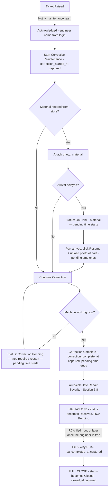

# Greenlam Tracker — Build Specification

**Status:** draft for sign-off. Written 7 September 2026.

**Why this document exists.** `Greenlam_Tracker.md` (the Round 2 decisions
document) resolves open items in a specification that was never written — it
cites "Section 5.4, line 180" and similar throughout, but no such file exists
on any machine we have. This document is that missing specification,
reconstructed so the Round 2 deltas have something to attach to. Its section
numbering is chosen to match the references in that document.

**Sources, in order of authority:**

1. `Greenlam_Tracker.md` — Round 2 decisions. Authoritative wherever it speaks.
2. Abhinav's handwritten roadmap (photographed 1 September 2026) and the
   WhatsApp constraints of the same date.
3. The system already built and running, which settles anything the two above
   leave open by demonstrating it works.

**How to read the markers:**

- **[DECIDED]** — settled by one of the three sources above. Build it.
- **[BUILT]** — already working today. Listed so nobody rebuilds it.
- **[NEEDS ANSWER]** — only Greenlam can decide. Nothing here is invented; where
  a value is missing it stays missing. Every one of these is collected in
  Section 13.
- **[CONFLICT]** — two sources disagree. Flagged, not silently resolved.

---

## 1. Objective and scope

Two surfaces over one database:

- **The app** — everyone on the floor. Raise a maintenance ticket; feed
  production data. Nothing else. *(Abhinav, 1 Sep: "App sirf maintenance ticket
  raise krne k liye and production data feed krne k liye.")*
- **The dashboard** — a named few, on a company device, in a browser. Read-only
  analysis of what the app collected. *(Abhinav: "Dashboard sirf website pe kaam
  kre jisko access grant ho.")*

Pilot in one unit, then the plant, then other plants. `plant_id` and `unit_id`
are on every table from the first migration even though the pilot is one unit.
**[BUILT]**

### 1.1 Out of scope for the pilot

Spare-parts inventory, purchase orders, vendor management, costing beyond a
downtime rate per machine, and any HR or attendance function.

---

## 2. The starting point

32 tables, 62 API endpoints and a working PWA exist today. What follows is
already built and does not need rebuilding:

| Area | State |
|---|---|
| Offline-first PWA, installable, Dexie outbox | **[BUILT]** |
| Sync engine — three devices, conflicting events, reconciliation | **[BUILT]**, 20 tests |
| Event-sourced tickets, client UUIDv7, append-only | **[BUILT]** |
| Ticket lifecycle incl. pending windows, handoff, reopen | **[BUILT]** — Section 5 |
| Solve Time / Repair Start Delay per Round 2 | **[BUILT]** |
| Bilingual en / hi / hi-Latn, including machine names | **[BUILT]** |
| QR machine scan, resolves offline | **[BUILT]** |
| Production + impregnation logging (old shape) | **[BUILT]**, superseded by Section 6 |
| Dashboard: KPIs, plant map, machine-by-machine, charts | **[BUILT]** |
| Excel import of the legacy register | **[BUILT]** |
| Excel export, nightly | **[BUILT]** via GitHub Actions — see Section 8 |
| Two-tier access (app / dashboard) | **[BUILT]**, superseded by Section 3 |
| Machine setup: hourly cost, scheduled hours, criticality | **[BUILT]** |

---

## 3. Access areas

**[DECIDED]** Eight access areas, granted independently by an administrator.
Combinable with no bleed-through; not tied to a job title. Somebody can hold
one, several, or all eight.

| # | Access area | Typical device | What it unlocks |
|---|---|---|---|
| 1 | **HPL Production** | Personal phone | Enter production data (Section 6) |
| 2 | **Maintenance** | Personal phone | Acknowledge, hold, resume, correction complete, RCA, handoff, reopen |
| 3 | **Supervisor** | Personal phone | Flagged- and reopened-ticket notifications; reopen; handoff on someone's behalf |
| 4 | **Manager** | Personal phone | Same as Supervisor, plus reassign to a named engineer (workload allocation). Not a hands-on role — no Acknowledge / Correction Complete / RCA |
| 5 | **Admin** | **Company device only** | Approve accounts, grant access areas, edit master lists |
| 6 | Dashboard sub-scope A | **Company device only** | **[NEEDS ANSWER]** |
| 7 | Dashboard sub-scope B | **Company device only** | **[NEEDS ANSWER]** |
| 8 | Dashboard sub-scope C | **Company device only** | **[NEEDS ANSWER]** |

> **[NEEDS ANSWER] 3-A.** The three Dashboard sub-scopes are named in the Round 2
> document but never defined. A plausible split is Maintenance / Production /
> Plant-wide, and Section 10 is written against that assumption — but it is an
> assumption, and auth is the wrong place to guess. Confirm the three, or
> replace them.

### 3.1 Raising a ticket does not need Maintenance access

Anyone with the app can raise a ticket. Only Maintenance can work one. An
operator who reports a breakdown is not thereby able to close it.

### 3.2 Company-device restriction

**[DECIDED]** The three Dashboard sub-scopes **and Admin** are restricted to
company-owned devices, enforced technically rather than by policy — management
laptops are company-issued and staff phones are not.

> **[NEEDS ANSWER] 3-B.** The enforcement mechanism. The Round 2 document names
> Conditional Access / IP allow-listing, which is Microsoft Entra. That
> contradicts on-prem hosting — see Section 11 **[CONFLICT]**. On a plant server
> the equivalent is an IP allow-list for the management subnet, or client
> certificates. Decide once, since it drives the whole auth design.

### 3.3 Names are never typed

**[BUILT]** Every name shown against an action is taken from the signed-in
account. This applies to Acknowledge, Handoff, Correct and Reopen alike:
*"Reopened by Subash"* appears in the app, on the dashboard and in Excel.

> **[NEEDS ANSWER] 3-C.** The handwritten roadmap puts **operator name** on the
> ticket form as a typed field. That only makes sense if a phone is shared
> between operators. If each person signs in as themselves, the field is
> redundant and should be dropped. If phones are shared, sign-in identity means
> "this device", not "this person", and that changes attribution everywhere.

### 3.4 Field / Trade

**[DECIDED]** Collected at signup when Department = Maintenance. If an
administrator grants Maintenance access to someone with no Field/Trade on file,
the approval screen must require one at that point — otherwise they appear in
the Handoff list with a blank trade badge and nobody can tell whether they are
right for the fault.

> **[NEEDS ANSWER] 3-D.** The list of Field/Trade values. Mechanical,
> Electrical, Instrumentation, Utilities — or whatever the plant actually uses.

---

## 4. Accounts

**[BUILT]** Employee ID plus a 6-digit PIN, argon2id-hashed with a server-side
pepper. Lockout after repeated failures; an administrator can unlock.

**[DECIDED]** Signup is a request, not a self-service account: a person
registers, an administrator approves and grants access areas. Department is
captured at signup; Field/Trade when Department = Maintenance (Section 3.4).

> **[NEEDS ANSWER] 4-A.** Is a 6-digit PIN acceptable to Greenlam IT for a system
> holding production data, or is SSO against the company directory required?
> The answer changes Section 11 substantially.

---

## 5. Maintenance

### 5.1 What a ticket is

One breakdown on one machine. Raised from the app, worked by Maintenance,
closed in two halves (Section 5.2).

**Fields captured on raise** — per the handwritten roadmap:

| Field | Source |
|---|---|
| Machine | Picked from the master, or resolved by QR scan **[BUILT]** |
| What happened | Free text, stored exactly as typed, never auto-translated **[BUILT]** |
| Operator | See **[NEEDS ANSWER] 3-C** |
| Shift | **[BUILT]** — shift master exists |
| Date / time | Captured automatically; see **[NEEDS ANSWER] 5-A** |
| Photo | Optional, Section 5.10 |

> **[CONFLICT] 5-A — priority.** The handwritten roadmap crosses out
> "urgency / priority". The Round 2 document does not mention it. The system
> today uses priority to drive acknowledgement targets (10 / 30 / 120 / 480
> minutes) and to rank the "needs attention" list.
>
> Removing it is defensible — a field where everything becomes Critical inside a
> month is worse than no field. But something has to replace it, or every ticket
> is equally urgent and the escalation logic has nothing to sort on. **Machine
> criticality A/B/C already exists** on the machine master and would do the job
> without asking the person raising the ticket to judge severity while standing
> next to a stopped press. **Recommended: drop priority, drive targets from
> machine criticality.** Needs a decision either way.

> **[NEEDS ANSWER] 5-B.** Should date/time be editable on raise, so a night-shift
> breakdown can be entered the next morning? Editable time and accurate response
> KPIs are in tension; if it is editable, backdated entries must be marked.

### 5.2 Lifecycle

**[DECIDED]** — the corrected flowchart from the Round 2 document. **[BUILT]**



**Acknowledge is first-tap-wins. [DECIDED] [BUILT]** Settled by a conditional
database write, not a check in the application — two people tapping inside the
same second both pass a read-then-write check. Whoever loses sees *"Already
acknowledged by [Name]"*.

### 5.3 Statuses and pending time

**[DECIDED] [BUILT]** Seven statuses: `raised`, `acknowledged`, `in_progress`,
`on_hold_material`, `correction_pending`, `resolved`, `closed`.

On Hold – Material and Correction Pending are **pauses inside correction**, not
steps after it — the flowchart loops out of both back to "Continue Correction".
They are stored as rows (`ticket_pending_windows`), not a running total, because
a repair can pause more than once and a single total cannot answer "how many
times" or "waiting on what".

At most one window is open per ticket, enforced by a partial unique index: two
overlapping holds would subtract the same wait twice and could drive Solve Time
below zero.

### 5.4 Handoff, Reopen, RCA timing

**Handoff [DECIDED] [BUILT]** — available from any active status (Acknowledged,
In Progress, On Hold – Material, Correction Pending). No reason is asked for; it
happens at every shift changeover and a mandatory box would fill with "shift".
`handed_off_by` records a Supervisor or Manager reassigning on someone else's
behalf.

**Reopen [DECIDED] [BUILT]** — anyone with Maintenance, Supervisor, Manager or
Admin access. A typed reason is required: reopening asserts the previous fix did
not hold. Recorded as *"Reopened by [Name]"* everywhere the ticket appears.
Operators cannot reopen.

**Reopen vs. new ticket — the SOP sentence. [DECIDED] [BUILT]** If the same
problem returns **within 48 hours** of the last fix, reopen the existing ticket.
After 48 hours, raise a new one.

**Reopen vs. Correct. [DECIDED]** Correct (Section 7) = something was mistyped;
the machine is fine, no reason required. Reopen = the machine is genuinely broken
again; a reason is required.

**RCA can be filed later.** Correction Complete half-closes the ticket so the
machine is recorded as running. The 5-Why can be filled in when the engineer is
free. The ticket is not fully closed until it is.

### 5.5 Timestamps

**[DECIDED] [BUILT]** Server clock when the device is online — that is what
stops an acknowledgement being backdated to look quick. Device clock when the
action happened in a dead zone and was queued; that timestamp travels with the
queued entry and the server does not re-stamp it at sync time, or every
dead-zone response time is wrong.

Which clock a timestamp came from is recorded (`ts_source`) so a phone with a
badly wrong clock is traceable. Not shown in daily use.

### 5.6 Escalation

**[BUILT]** Derived from timestamps on read, never stored — a stalled scheduler
would leave the board looking calm while a press sits dead.

> **[NEEDS ANSWER] 5-C.** The acknowledgement targets themselves. The current
> 10/30/120/480 minutes are a placeholder. Set too tight, the board is
> permanently red and everyone learns to ignore it. Depends on **[CONFLICT] 5-A**.

### 5.7 Closure-integrity flags

**[DECIDED]** Three flags, each raising a notification to Supervisors and
Managers:

1. **No follow-up production** — the ticket was closed but no production was
   logged on that machine within the window. Requires a scheduled job
   (Section 11), because it checks for the *absence* of activity and cannot be
   evaluated until the window has elapsed.
2. **Repeat failure** — a *new* ticket raised on the same machine within 48
   hours, instead of reopening the old one. Usually a different shift not
   realising a ticket existed.
3. **High Repair Severity** — Section 5.8.

> **[NEEDS ANSWER] 5-D.** The no-follow-up-production window. Hours? A shift?

### 5.8 Solve Time and Repair Severity

**[DECIDED] [BUILT]**

```
Solve Time = (correction_complete_at − correction_started_at) − pending_time_total
```

Measured from when work started, not from acknowledgement. The wait before
someone picks up a spanner is a real problem with a different owner; folding it
in made a fast repair on a busy shift look slow.

Every hold and every correction-pending stall is excluded and tracked
separately.

> **[NEEDS ANSWER] 5-E.** Repair Severity thresholds — what Solve Time counts as
> low, medium, high. Admin-configurable, but they need starting values. Worth
> revisiting after a few weeks of real data, since the formula changed and
> measured repair times will read shorter than before across the board.

### 5.9 Repair Start Delay

**[DECIDED] [BUILT]** `correction_started_at − acknowledged_at`, as its own KPI.
This is the number that exposes a team acknowledging quickly to stop the clock
and then not starting.

### 5.10 Photos

**[BUILT]** Attachments table, storage key only, never a URL — the backend is
swappable so an on-prem mandate changes one class, not the schema.

**[DECIDED]** A photo is required when material is requested, and again when the
part arrives and the ticket resumes.

> **[NEEDS ANSWER] 5-F.** Retention and storage location for photos, especially
> under on-prem hosting. A year of floor photos is not small.

---

## 6. Production

### 6.1 Entering production

**[DECIDED]** The app opens on two choices — **Maintenance** and **Production** —
and production leads to: pick machine → operator, date, time → then a form that
depends on what kind of machine it is.

### 6.2 Areas

The section/area master. **[BUILT]** — the row previously labelled "AC Section"
is renamed **AC Room** **[DECIDED]**.

> **[NEEDS ANSWER] 6-A.** The full area list as the plant names them. The seeded
> list is a placeholder and every one of its values is invented.

### 6.3 Production entries, by machine type

**[DECIDED]** — from the handwritten roadmap. Three shapes:

**Press and general machines**
| Field | Notes |
|---|---|
| Material code | Drives size, thickness, paper grade, company — see 6.4 |
| Number of sheets | |
| OK / Not OK | Per batch |
| Why not OK | Optional, from the reject-reason master **[BUILT]** |

**Resin kettle**
| Field | Notes |
|---|---|
| Batch number | The identifier the impregnator later references |
| Quantity | |
| Operator, date, time | |
| Accepted / rejected | "for resin as well" — same accept/reject discipline |

**Impregnator / dryer**
| Field | Notes |
|---|---|
| Paper: grade, thickness, GSM, company | **[BUILT]** |
| **Resin batch number** | Links this roll to the resin kettle batch — new |
| RC and VC | **[BUILT]** |
| Thickness after drying | **[BUILT]** |

> **[NEEDS ANSWER] 6-B.** Is OK/Not OK per sheet or per batch? The roadmap shows
> it beside "No. of sheets", which reads as per batch.

> **[NEEDS ANSWER] 6-C.** Who generates the resin batch number — the system or a
> person — and what is its format?

### 6.4 Material code

**[DECIDED]** A material-code master, where the code carries size, thickness,
paper grade and company. The operator picks a code; the attributes follow. This
is the single most valuable addition in the roadmap: it turns four free choices
into one, and makes 6.5 possible.

> **[NEEDS ANSWER] 6-D.** The material code master itself — the codes and what
> each one means. Nothing in Section 6 can be built without it. **This is the
> critical-path item.**

### 6.5 Traceability

**[DECIDED]** Resin batch → impregnated roll → pressed sheet. A defect found at
the press can be traced back to the resin batch it came from.

The system already shows that paper outside its RC/VC spec window rejects at a
materially higher rate than paper inside it. **[BUILT]** Adding the resin batch
link extends that from "which roll" to "which resin".

> **[NEEDS ANSWER] 6-E.** RC and VC limits per paper grade. Currently
> placeholders. The blister-prediction feature is only as good as these numbers.

---

## 7. Correct — fixing a typo

**[DECIDED]** Any field entered by a person can be corrected. No reason is
required: the correction is self-explanatory and the machine was never broken
again (that is Reopen, Section 5.4).

Every correction keeps an edit history — who, when, old value, new value — held
internally rather than shown in daily use.

> **[NEEDS ANSWER] 7-A.** Who may correct: only the person who entered it, or
> anyone with Maintenance access? And is there a time limit after which an entry
> is frozen?

---

## 8. The Excel mirror

**[BUILT]** A workbook is rebuilt nightly from the database and matches the
plant's existing register columns. It runs on a GitHub Actions runner against a
read-only database role, never on the web server.

**[DECIDED — Round 2]** Writes go to the database first and are queued for Excel
afterwards; a user-facing save never waits on Excel. Retry with backoff on
throttling; a daily reconciliation compares database rows against the workbook
so silent drift is caught.

> **[CONFLICT] 8-A.** The Round 2 document specifies **Microsoft Graph API** —
> that is SharePoint or OneDrive, and requires a Microsoft 365 tenant and
> internet access from the server. It contradicts on-prem hosting (Section 11).
> If the plant server has no internet, the workbook is written to a file share
> instead and Graph does not enter into it.

---

## 9. Notifications

**[DECIDED]** Push on: ticket raised (to the maintenance team), ticket reopened
(to maintenance, Supervisors and Managers — worded distinctly so it is never
mistaken for a new breakdown), and each flag in Section 5.7 (to Supervisors and
Managers).

> **[CONFLICT] 9-A — this will not work on an isolated plant server.** Verified,
> not assumed: web push always travels through the browser vendor's push service
> (Google FCM for Chrome, Mozilla for Firefox). Self-hosting the application
> server does not change that. A plant server with no outbound internet cannot
> deliver a push notification at all.
>
> Options, in order of preference:
> 1. Allow outbound HTTPS to the push services through the firewall. Push then
>    works normally.
> 2. A wall display in the maintenance room with an audible alert. Needs no
>    internet and is the most reliable thing in a noisy plant.
> 3. In-app only — the technician sees it when the app is open, and not
>    otherwise. Insufficient on its own.
> 4. An on-premise SMS gateway.
>
> **Recommended: 1 and 2 together.** Do not rely on the phone alone.

---

## 10. The dashboard

**[DECIDED]** Browser only, company device, access-granted. Live — it reflects
each entry as it arrives.

Content **[BUILT]** unless marked:
- Downtime, MTTR, MTTA, availability, MTBF, first-time-fix, root-cause quality
- Downtime cost, withheld entirely until every machine has an hourly rate — a
  total covering half the plant looks complete and is silently low
- Plant map, clickable, machine by machine
- Pareto by cause, trend, ageing
- **Reopened** and **Repeat-Failure-linked** as two separate counts **[DECIDED]** —
  they are different situations and must not be merged into one "recurring
  issues" number
- Production and maintenance per machine, **section-wise and material-code-wise**
  — material-code-wise is new and depends on **[NEEDS ANSWER] 6-D**

**[BUILT]** Individual technician metrics are visible to that person and their
supervisor only. Never on the main dashboard, never in an emailed workbook,
never as a peer-visible ranking.

> **[NEEDS ANSWER] 10-A.** "Live" — refreshed every 30 seconds is straightforward;
> instant needs a websocket. Which?

---

## 11. Tech stack and hosting

**[BUILT]** Python 3.13 / FastAPI / SQLModel / Alembic, PostgreSQL, one
Vite + React + TypeScript PWA, Dexie offline store, `packages/core` for logic
shared between phone, server and export. `docker-compose.yml` exists from day
one precisely so hosting stays a deployment choice.

**[DECIDED]** A scheduled worker, every 15–30 minutes, for the
no-follow-up-production flag (Section 5.7). Nothing in the stack performs this
check today.

> **[CONFLICT] 11-A — where this runs.** Abhinav, 1 September: *"me apne private
> laptop pe company data use nhi kr skta hu, esa kuch bnana he jo company server
> pe host hojaye."* The Round 2 document specifies Microsoft Graph API (Section 8)
> and Conditional Access (Section 3.2) — both Microsoft cloud.
>
> These cannot both be true. **This is the single most important open question**:
> it determines hosting, authentication, Excel sync and notifications together.

> **[NEEDS ANSWER] 11-B — HTTPS on the plant network.** Verified: installing the
> app on a phone, and its offline shell, both require HTTPS with a **trusted**
> certificate. A self-signed certificate is refused — the browser will not
> register the service worker. On a plant LAN that means an internal certificate
> authority whose root is pushed to every phone, or a real domain resolving
> internally.
>
> Without it the app still opens in a browser but **cannot be installed and has
> no offline capability at all** — which removes the foundation the whole design
> rests on, since the press hall has no signal.

> **[NEEDS ANSWER] 11-C.** Server specification, who administers it, and the
> backup arrangement. A plant server holding the maintenance history needs an
> owner.

---

## 12. Offline and sync

**[BUILT]** Every entry saves to the device the instant it is made and syncs in
the background. No write ever blocks on the network. Local storage is the
source of truth for the person using it.

**[DECIDED] [BUILT]** Every action carries a client-generated submission ID:
Raise, Save Draft, Submit, Acknowledge, Hold, Resume, Correction Complete, RCA
save, **Handoff, Reopen and Correct**. A retry over a dropped connection is a
no-op, not a duplicate.

**[BUILT]** Ticket state is derived by replaying an append-only event log.
Stages move forward only, except an explicit Reopen. A late-arriving
acknowledgement cannot un-close a ticket. Tested against three devices going
offline, generating conflicting events, and reconciling — including a device
with a wrong clock.

---

## 13. Open questions

**Superseded in large part by `Greenlam_Tracker_Master_Build_Specification_V5.md`
(7 September 2026).** V5 answers fifteen of the twenty-three questions below, and
answers the one that blocked the most — the material code master — by removing
the requirement rather than filling it in. What remains is listed second.

### Answered by V5

| # | Question | V5's answer |
|---|---|---|
| 6-D | The material code master | **Deleted.** SAP stays external; a manually typed **Load No.** is the traceability key (§6.2A). Operators never enter the 60+ codes inside a load. |
| 3-A | The three Dashboard sub-scopes | There are none. **Dashboard is one grant**; the three views live inside it (§3). |
| 3-B | Company-device enforcement | Microsoft Entra ID Conditional Access, falling back to IP allow-listing on the dashboard route (§3). |
| 3-C | Typed operator name, or from the login | **From the login, everywhere.** Phones are personal, not shared (§3). |
| 4-A | PIN or company SSO | Both, split by surface: self-signup + PIN on the floor, Entra SSO for Dashboard and Admin (§12). |
| 5-A | Priority: removed or replaced | **Removed.** Criticality is calculated from solve time after the repair (§5.8). |
| 5-B | Editable breakdown date/time | Never. System clock only; a wrong stamp is fixed through the tagged correction path (§5.5). |
| 5-E | Repair Severity thresholds | Press 30 / 60 min, everything else 60 / 120 min, admin-configurable (§5.8, §16). |
| 6-A | The real area list | The Machine Master List (§4). |
| 6-B | OK / Not OK per sheet or per batch | Counts per entry, with a reason, not per sheet (§6.2). |
| 6-C | Resin batch number format | **Made optional** until the floor's actual resin register is confirmed (§6.2, §16). |
| 7-A | Who may Correct, and any freeze period | The submitter, for 5 h after a ticket fully closes or 10 h after a production entry is submitted; admin at any time (§7). |
| 8-A | Excel via Graph API or a file share | Microsoft Graph, with in-place row updates keyed on a stable id (§7, §8). |
| 9-A | Notification route | Web Push (VAPID) through the installed PWA; iOS needs Add to Home Screen (§9). |
| 11-A | On-prem plant server or Microsoft cloud | **Neither purely.** Internet-facing and reachable over mobile data; the host (TCS or otherwise) is still open (§14). |

### Still open

| # | Question | Blocks |
|---|---|---|
| 11-C | Server specification, who administers it, backups | Nothing yet — but it decides where this runs |
| 11-B | Who provides the TLS certificate and the hostname | Install and offline on real phones |
| 5-C | Acknowledgement targets | Escalation timings are still placeholders |
| 5-D | The no-follow-up-production window | The closure-integrity flag. V5 §16 defers it deliberately until the trial produces a baseline |
| 5-F | Photo retention and storage | Attachment storage, which nothing writes to yet |
| 6-E | RC and VC limits per paper grade | Out-of-spec warnings on the roll form |
| 3-D | The Field/Trade list | Nothing. Dropped from V5 entirely — confirm it is dead rather than forgotten |
| — | Criticality A/B/C per machine | **The live queue's ordering.** Every machine is seeded B, so every open ticket ranks the same. This is now the highest-value missing answer in the whole system |

### Contradictions V5 does not resolve

- **"Hundreds to thousands of concurrent users" against the current hosting.**
  Render's free tier is 512 MB, 0.1 CPU, and sleeps after 15 minutes idle. Fine
  for the synthetic demo, wrong for the plant. A hosting decision, not something
  the code can absorb.
- **Full close.** V5 §5.4 says filing the RCA closes the ticket automatically.
  The build still asks for a separate Close with a resolution rating, which V5
  does not mention. One of the two has to give.

---

## 14. Sequencing

Assuming the answers arrive in the order above:

1. **Now, needing nothing** — the app's Maintenance / Production split, the
   revised ticket form, and the production forms by machine type with
   placeholder masters. Structure first; the lists drop in later.
2. **On 6-D** — material code master, resin batch, and the traceability chain.
3. **On 3-A and 3-B** — the eight access areas. Auth is not something to build
   halfway; it waits for a complete answer.
4. **On 11-A and 11-B** — the on-prem deployment, HTTPS, and whichever
   notification route follows from it.
5. **After the pilot has run** — retune 5-C and 5-E against real data rather
   than guesses.
